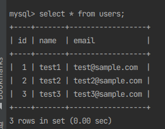
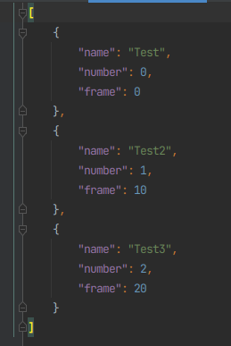

# Python-MySQL-Sample

Sample of writing to mysql in docker with python.

## Installing

---

- Docker
- Docker Compose
- Python 3.9.x
    - mysql-connector-python (pip)

## Configurations

---

```
Python-MySQL-Sample
├── docs
│   └── figures
├── db
│   ├── migration
│   ├── Dockerfile
│   └── docker-compose.yml
├── resources
│   └── jsons
└── src
    ├── sql_source
    └── ${Python files to run}
```

## Tests

---

Run the following command:

Terminal1
```shell
cd Python-MySQL-Sample/db
docker-compose up -d
```

Terminal2
```shell
python3 src/main.py
```

### Other Table Operations

**View Table Name** <br>
```shell
python3 src/show.py
```

<br>

> **Warning** <br>
> Note that if you do the following, all tables will be empty!

**Delete all data in table** <br>
```shell
python3 src/delete.py
```

## Results

---

Table Content : 



<br>

json content : 

